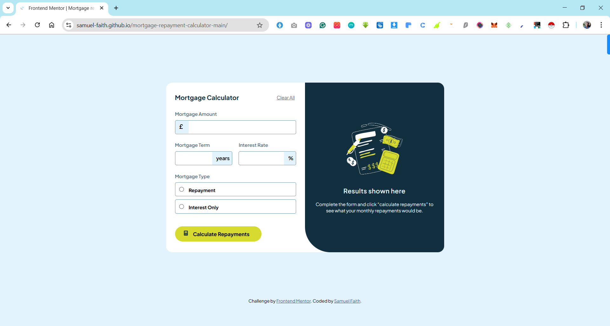

# Frontend Mentor - Mortgage repayment calculator solution

This is a solution to the [Mortgage repayment calculator challenge on Frontend Mentor](https://www.frontendmentor.io/challenges/mortgage-repayment-calculator-Galx1LXK73). Frontend Mentor challenges help you improve your coding skills by building realistic projects. 

## Table of contents

- [Overview](#overview)
  - [The challenge](#the-challenge)
  - [Screenshot](#screenshot)
  - [Links](#links)
- [My process](#my-process)
  - [Built with](#built-with)
  - [What I learned](#what-i-learned)
  - [Continued development](#continued-development)
- [Author](#author)

**Note: Delete this note and update the table of contents based on what sections you keep.**

## Overview

### The challenge

Users should be able to:

- Input mortgage information and see monthly repayment and total repayment amounts after submitting the form
- See form validation messages if any field is incomplete
- Complete the form only using their keyboard
- View the optimal layout for the interface depending on their device's screen size
- See hover and focus states for all interactive elements on the page

### Screenshot

### Links

- Solution URL: [Add solution URL here](https://github.com/samuel-faith/mortgage-repayment-calculator-main)
- Live Site URL: [Add live site URL here](https://samuel-faith.github.io/mortgage-repayment-calculator-main/)

## My process

### Built with

- Semantic HTML5
- CSS custom properties
- CSS Flexbox
- CSS Grid
- JavaScript (Vanilla)

### What I learned

- How to calculate monthly mortgage repayments
- Improved my understanding of form validation and accessibility.
- Enhanced responsive design techniques using media queries and flexible grid systems.

### Continued development

In future projects, I’d like to:

- Add more advanced financial metrics (e.g., total interest paid, amortization schedule).

- Implement local storage to retain user inputs across sessions.

- Explore React for building more scalable UI components.

## Author

- Website - [Adelaja Samuel Faith](https://github.com/samuel-faith)
- Frontend Mentor - [@samuel-faith](https://www.frontendmentor.io/profile/samuel-faith)
- Twitter - [@samuel_delaja](https://www.twitter.com/samuel_delaja)
